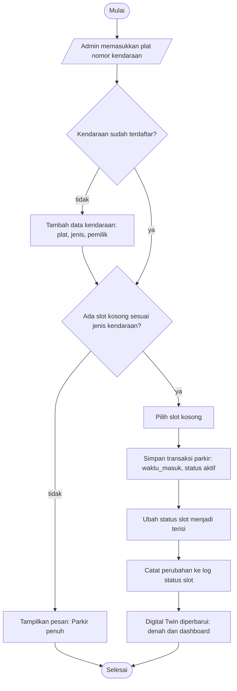
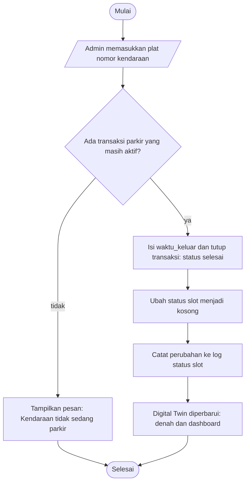
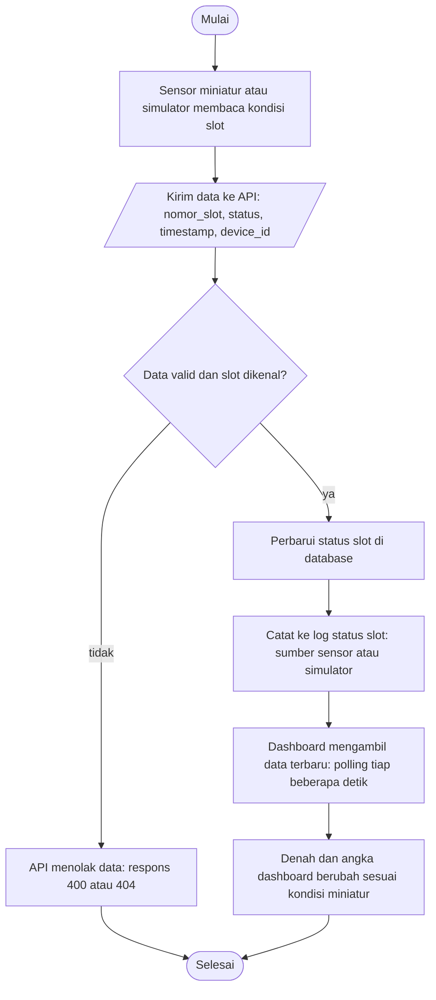
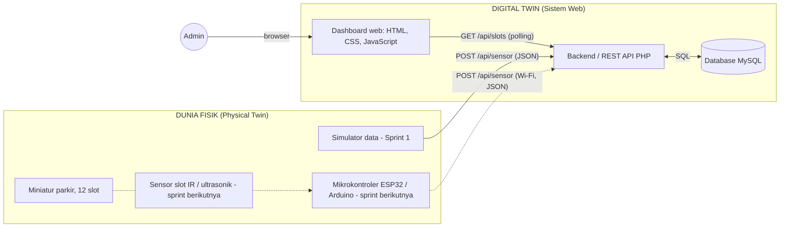
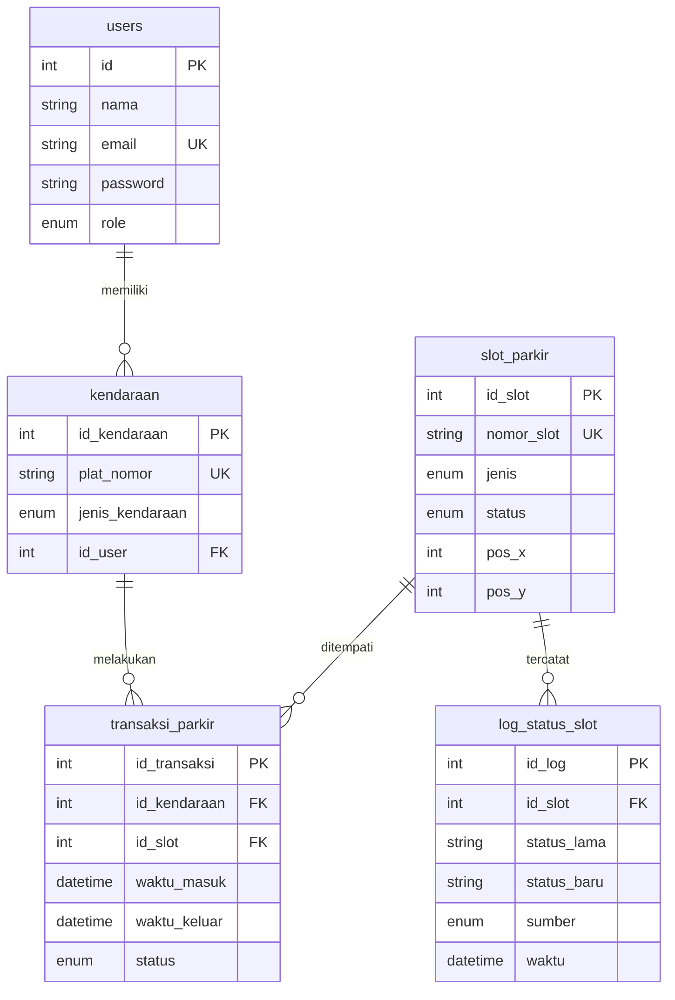

# Dokumen Desain dan Arsitektur — Digital Twin Sistem Parkir

**Sprint 1 / Product Release 1** | 30 September 2026

Dokumen ini memuat dua bagian tugas Sprint 1: **(2) Dokumen Desain dan Arsitektur** dan **(3) Inisialisasi Kode Proyek**. Diagram ditulis dengan Mermaid sehingga tampil langsung di GitHub, dan versi gambarnya (PNG) tersedia di folder `docs/`.

## Pemetaan kebutuhan tugas

| Kebutuhan tugas | Isi dokumen | Bagian |
|---|---|---|
| Rancangan UX/UI (wireframe, mockup, purwarupa) | 5 wireframe halaman dan prototype berjalan di `frontend/` | 1 dan 3 |
| Rancangan sistem: flowchart | 3 flowchart: kendaraan masuk, kendaraan keluar, sinkronisasi miniatur | 2.1 |
| Rancangan sistem: arsitektur sistem | Diagram arsitektur physical twin dan digital twin | 2.2 |
| Rancangan sistem: struktur database (ERD) | ERD 5 tabel dan kamus data | 2.3 |
| Kerangka dasar (boilerplate / starter code) | Struktur folder, prototype frontend, kerangka backend PHP, `database.sql` | 3 |

## Konsep singkat

Miniatur parkir adalah **physical twin** (dunia nyata). Website atau dashboard adalah **digital twin**: menampilkan denah, status slot, kendaraan, dan riwayat.

Pada Sprint 1 sensor belum dipasang, sehingga **sensor/miniatur masih menggunakan simulasi data pada tahap prototype**. Simulator mengubah status slot dengan format yang sama seperti nanti dikirim sensor. Saat sensor asli dipasang, backend dan dashboard tidak perlu diubah.

---

## 1. Rancangan UX/UI

**Alur pengguna:** admin masuk lewat halaman login, melihat ringkasan di dashboard, membuka denah untuk melihat atau mengubah status slot, lalu membuka data kendaraan dan riwayat bila perlu. Navigasi memakai sidebar tetap di kiri.

### Prinsip desain

| Aspek | Keputusan |
|---|---|
| Warna status | Hijau = kosong, merah = terisi, abu-biru = maintenance. Status selalu ditulis dengan teks, tidak hanya warna. |
| Denah | Slot digambar di atas latar aspal gelap dengan tanda MASUK dan KELUAR, meniru area parkir sebenarnya. |
| Aksen | Kuning marka jalan dipakai hanya untuk menu aktif dan slot yang dipilih. |
| Tata letak | Sidebar tetap dan area konten. Pada layar kecil sidebar berubah menjadi bar atas. |
| Bahasa | Kalimat singkat dan langsung, misalnya tombol "Simpan status" dan "Simulasikan perubahan". |

### Wireframe 1 — Login


- Fungsi terkait: **EI01** (Login admin).
- Elemen: email, password, tombol Masuk, pesan kesalahan di bawah tombol jika email atau password salah.

### Wireframe 2 — Dashboard


- Fungsi terkait: **EO01** (Dashboard ringkasan parkir).
- Elemen: empat kartu angka (total slot, terisi, kosong, okupansi), denah ringkas, lima aktivitas terakhir, tombol "Simulasikan perubahan" (mengubah satu slot secara acak sebagai pengganti sensor).

### Wireframe 3 — Denah Parkir


- Fungsi terkait: **EQ01** (lihat denah), **EI08** (ubah status manual), **EI09** (data simulator).
- Elemen: legenda status, denah 12 slot (P01 sampai P12) dengan tanda MASUK dan KELUAR, panel detail slot yang dipilih (ubah status dan simpan), panel simulasi otomatis (satu slot berubah tiap 4 detik).

### Wireframe 4 — Data Kendaraan


- Fungsi terkait: **EQ03** (daftar kendaraan) dan **EQ04** (cari kendaraan).
- Elemen: kolom pencarian plat atau pemilik, tabel (No, Plat Nomor, Jenis, Pemilik, Status). Tombol "Tambah kendaraan" aktif di Sprint 2.

### Wireframe 5 — Riwayat Parkir


- Fungsi terkait: **EQ05** (riwayat parkir) dan **EQ06** (log perubahan status slot).
- Elemen: filter plat, status, dan tanggal; tabel (Waktu, Kendaraan, Slot, Status, Sumber). Sprint 1 membaca log perubahan status slot.

### Purwarupa yang berjalan

Selain wireframe, kelima halaman sudah dibuat sebagai purwarupa web di folder `frontend/` (lihat bagian 3). Halaman tersebut bisa dijadikan bahan mockup atau tangkapan layar untuk laporan.

---

## 2. Rancangan Sistem

### 2.1 Flowchart

#### Flowchart 1 — Kendaraan masuk

Slot dicari sesuai jenis kendaraan. Jika penuh, proses berhenti dengan pesan.



Gambar: `flowchart-masuk.png`

#### Flowchart 2 — Kendaraan keluar

Transaksi ditutup dan slot kembali kosong.



Gambar: `flowchart-keluar.png`

#### Flowchart 3 — Sinkronisasi miniatur ke Digital Twin

Inti digital twin: perubahan di miniatur muncul di dashboard.



Gambar: `flowchart-sinkronisasi.png`

### 2.2 Arsitektur sistem



Gambar: `architecture.png`. Garis putus-putus adalah bagian yang dikerjakan pada sprint berikutnya.

| Komponen | Peran | Sprint |
|---|---|---|
| Miniatur parkir | Representasi fisik area parkir (12 slot). | Berikutnya |
| Sensor + mikrokontroler | Membaca terisi atau kosong tiap slot lalu mengirim ke API lewat Wi-Fi. | Berikutnya |
| Simulator data | Sensor/miniatur masih menggunakan simulasi data pada tahap prototype. Mengubah status slot dengan format yang sama seperti sensor. | 1 |
| Backend / REST API (PHP) | Menerima data sensor, memeriksa validasi, menyimpan ke database, melayani dashboard. | 1 (kerangka) |
| Database MySQL | Menyimpan pengguna, kendaraan, slot, transaksi, dan log status slot. | 1 |
| Dashboard web | Menampilkan denah, status, kendaraan, dan riwayat; mengambil data terbaru dengan polling. | 1 (prototype) |

**Contoh format data sensor atau simulator**

```http
POST /api/sensor.php
X-Device-Key: <kunci perangkat>
Content-Type: application/json

{
  "nomor_slot": "P05",
  "status": "terisi",
  "device_id": "sim-01",
  "timestamp": "2026-09-30T10:42:15+07:00"
}
```

### 2.3 ERD dan kamus data



Gambar: `erd.png`

| Tabel | Kolom | Keterangan |
|---|---|---|
| `users` | `id` (PK), `nama`, `email`, `password`, `role` | Akun admin atau operator. Password disimpan sebagai hash bcrypt, bukan teks asli. |
| `kendaraan` | `id_kendaraan` (PK), `plat_nomor`, `jenis_kendaraan`, `id_user` (FK) | Kendaraan terdaftar dan pemiliknya. |
| `slot_parkir` | `id_slot` (PK), `nomor_slot`, `jenis`, `status`, `pos_x`, `pos_y` | Slot beserta status terkini dan posisi pada denah. |
| `transaksi_parkir` | `id_transaksi` (PK), `id_kendaraan` (FK), `id_slot` (FK), `waktu_masuk`, `waktu_keluar`, `status` | Satu baris tiap kendaraan parkir. `waktu_keluar` kosong selama status `aktif`. |
| `log_status_slot` | `id_log` (PK), `id_slot` (FK), `status_lama`, `status_baru`, `sumber`, `waktu` | Riwayat kondisi twin. `sumber` bernilai `manual`, `simulator`, atau `sensor`. |

**Nilai enum:** `role` (admin, operator); `jenis_kendaraan` dan `jenis` (mobil, motor); `status` slot (kosong, terisi, maintenance); `status` transaksi (aktif, selesai).

> Catatan: tabel `log_status_slot` dan kolom `pos_x`/`pos_y` adalah tambahan di atas rancangan awal, dipakai untuk riwayat kondisi dan penggambaran denah. Keduanya sudah ikut dihitung pada dokumen Function Point.

---

## 3. Inisialisasi Kode Proyek

Kerangka awal sudah dapat dijalankan sehingga project siap masuk ke tahap development Product Release 1.

### Struktur folder

```
digital-twin-parkir/
├── README.md
├── docs/                    wireframe, flowchart, arsitektur, ERD,
│                            Function Point, dokumen desain
├── frontend/
│   ├── index.html           login
│   ├── dashboard.html
│   ├── denah.html
│   ├── kendaraan.html
│   ├── riwayat.html
│   ├── css/style.css
│   └── js/app.js            data simulasi dan logika tampilan
├── backend/
│   ├── config.php
│   ├── db.php
│   └── api/
│       ├── login.php
│       ├── slots.php
│       └── sensor.php
└── database/
    └── database.sql         skema dan data awal
```

### Kondisi tiap bagian

| Bagian | Kondisi saat ini | Cara mencoba |
|---|---|---|
| Frontend | Lima halaman berjalan dengan data simulasi di browser (`localStorage`). Tombol simulasi mengubah status slot dan mencatat riwayat. | Buka `frontend/index.html`. Akun demo `admin@parkir.test` / `admin123`. |
| Database | Lima tabel dengan kunci relasi dan data awal: 12 slot, 8 kendaraan, 1 akun admin. | `mysql -u root -p < database/database.sql` |
| Backend | Kerangka API PHP: login, daftar dan ubah slot, penerimaan data sensor. Belum terhubung ke frontend. | `php -S localhost:8080 -t backend` |

### Menjalankan prototype frontend

```bash
cd frontend
python3 -m http.server 8000
```

Buka http://localhost:8000 lalu login dengan `admin@parkir.test` / `admin123`. Tombol "Reset data" di halaman Denah mengembalikan kondisi awal.

### Menyiapkan database dan backend

1. Pastikan MySQL/MariaDB dan PHP 8 aktif (XAMPP atau Laragon juga bisa).
2. Impor skema: `mysql -u root -p < database/database.sql`
3. Sesuaikan `backend/config.php`, atau isi variabel lingkungan `DB_HOST`, `DB_NAME`, `DB_USER`, `DB_PASS`, `DEVICE_KEY`.
4. Jalankan server pengembangan: `php -S localhost:8080 -t backend`

### Endpoint API (kerangka)

| Metode dan alamat | Fungsi | Autentikasi | Respons utama |
|---|---|---|---|
| `POST /api/login.php` | Login admin, body `{"email","password"}` | Tidak perlu | 200 berhasil, 401 salah email/password |
| `GET /api/slots.php` | Daftar slot dan ringkasan (dipakai dashboard) | Tidak perlu | 200 |
| `POST /api/slots.php` | Ubah status slot manual, body `{"nomor_slot","status"}` | Sesi login | 200, 400 status tidak valid, 401, 404 slot tidak ada |
| `POST /api/sensor.php` | Terima data sensor atau simulator | Header `X-Device-Key` | 200, 400 data tidak lengkap, 401 kunci salah, 404 slot tidak ada |

Setiap perubahan status slot ditulis ke tabel `slot_parkir` dan `log_status_slot` dalam satu transaksi database.

### Hasil pengujian

| Bagian | Hasil |
|---|---|
| Frontend | Semua halaman dimuat tanpa error di uji otomatis (jsdom). Login benar dan salah, ubah status slot, cari kendaraan, dan filter riwayat berfungsi. 200 langkah simulasi acak tidak menghasilkan data yang tidak konsisten (satu plat hanya di satu slot, slot terisi selalu punya plat). |
| SQL | Sintaks 18 pernyataan lolos pemeriksaan parser MySQL. Belum dijalankan pada server MySQL. |
| PHP | **Belum diuji.** Kode ditulis sebagai kerangka. Jalankan dan uji di komputer lokal sebelum dipakai pada sprint berikutnya. |

---

## 4. Rencana sprint berikutnya

- Hubungkan frontend ke API (`GET /api/slots.php` dengan polling).
- CRUD kendaraan dan slot, pencatatan kendaraan masuk dan keluar.
- Halaman riwayat membaca database, tambahkan laporan parkir.
- Buat skrip simulator yang mengirim data ke `/api/sensor.php`.
- Integrasi sensor miniatur (ESP32 atau Arduino).

## 5. Checklist tugas (poin 2 dan 3)

- [x] Rancangan UX/UI: 5 wireframe (dan purwarupa di `frontend/`)
- [x] Flowchart (3 alur)
- [x] Arsitektur sistem
- [x] ERD dan kamus data
- [x] Struktur folder awal proyek
- [x] Kerangka kode (frontend, backend)
- [x] Inisialisasi basis data (`database.sql`)
- [x] README.md
- [ ] Isi nama anggota tim di `README.md`
- [ ] Buat repository GitHub, commit bertahap, dan push
- [ ] Kumpulkan link repository di Classroom

### Urutan commit yang disarankan

```bash
git init
git add README.md && git commit -m "Initial project setup"
git add docs/03_Function_Point.* && git commit -m "Add function point calculation"
git add docs/wireframe-*.png && git commit -m "Add UI wireframe"
git add docs/flowchart-*.png docs/architecture.png docs/erd.png docs/04_Desain_dan_Arsitektur.* && git commit -m "Add system design diagrams"
git add database && git commit -m "Add database structure"
git add frontend backend && git commit -m "Add frontend prototype and backend skeleton"
git branch -M main
git remote add origin https://github.com/<username>/digital-twin-parkir.git
git push -u origin main
```
